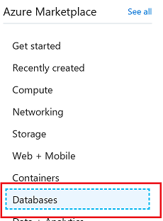
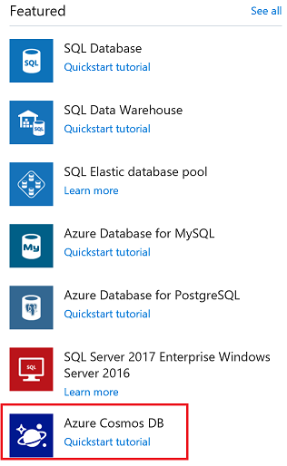
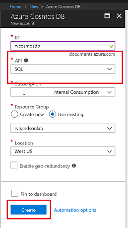
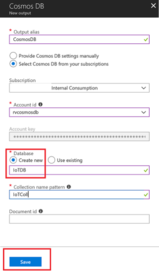
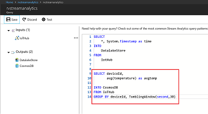
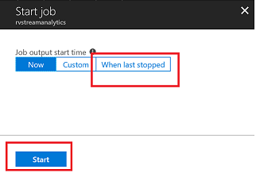

# Hot Path Analytics with CosmosDB

## Overview

Azure Cosmos DB is Microsoft's globally distributed, multi-model database. The atom-record-sequence (ARS) based data model that Azure Cosmos DB is built on natively supports multiple data models, including but not limited to document, graph, key-value, table, and column-family data models

Elastically and independently scale throughput and storage on demand and worldwide

Azure Cosmos DB provides five consistency levels: strong, bounded-staleness, session, consistent prefix, and eventual. 

In this lab you will learn

* how to set up a CosmosDB
* streaming analytics with windowing techniques
* to Store Time Series Data in CosmosDB

## Task 1: Create Cosmos DB Account

Click on **Create a resource**


Click on **Databases**



Click on **Azure Cosmos DB**



Please select the SQL API type:



> CosmosDB is a cloud native database which is able to support several APIs for interaction. 
1. SQL API: A schema-less JSON database engine with rich SQL querying capabilities.
1. MongoDB API: A massively scalable MongoDB-as-a-Service powered by Azure Cosmos DB platform. Compatible with existing MongoDB libraries, drivers, tools, and applications.
1. Cassandra API: A globally distributed Cassandra-as-a-Service powered by Azure Cosmos DB platform. Compatible with existing Apache Cassandra libraries, drivers, tools, and applications.
1. Graph (Gremlin) API: A fully managed, horizontally scalable graph database service that makes it easy to build and run applications that work with highly connected datasets supporting Open Graph APIs (based on the Apache TinkerPop specification, Apache Gremlin).
1. Table API: A key-value database service built to provide premium capabilities (for example, automatic indexing, guaranteed low latency, global distribution) to existing Azure Table storage applications without making any app changes

## Task 2: Stop Stream Analytics

To Add Cosmos DB as output to Stream Analytics Job you will need to Stop the job, Add Cosmos DB output and corresponding Query and Start the job


Stream Data To Cosmos DB:


Add Cosmos DB as an Output to Stream Analytics Job


Select Cosmos DB as an output. Also make sure you create a new Database and a collection if its is not already created



Edit existing query to Add new query to consume data from IoTHub and store data into Cosmos DB

**Please keep the existing "insert" statement as is. Just add the following query below:**

```sql
SELECT
    deviceId, avg(temperature) as avgtemp
INTO
    CosmosDB
FROM
    IotHub
GROUP BY deviceId, TumblingWindow(second,30)
```



## Task 3: Start Streaming Again

Start Stream Analytics Job


Make sure you stream all the data from when you last stopped the job. Stream Analytics interface provides an option



Make sure Stream Analytics job goes into running mode


## Task 4: Explore CosmosDB Data

Use Cosmos DB data explorer to view data being streamed from IoTHub to Cosmos DB


