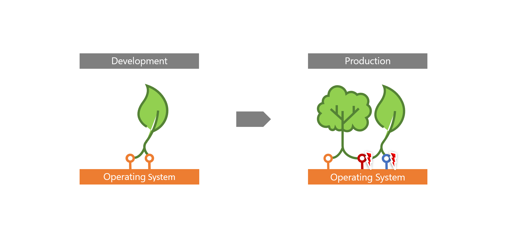
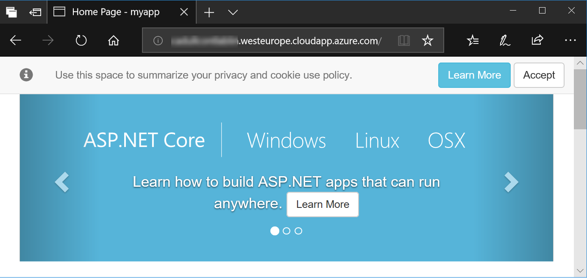

# Introduction to Containers on Azure

## Overview

Containers are revolutionizing the way how software is being deployed. This lab will provide the foundation for working with containers and enable participants to deploy single container applications to the Azure cloud. The lab will start with a general introduction to the Docker environment, then show how applications can be containerized using so-called Dockerfiles and published to Azure Container Registry (ACR). Finally, we will be deploying the dockerized application to Azure Container Instances (ACI) and Azure Web Sites.

### Why containers?

All too often, differences between our development environments ("runs on my machine!") and production environments lead to problems on releasing our app: version conflicts, subtle configuration issues, noisy neighbor applications taking all resources.

   

Containers help solve this problem by virtualizing the interfaces the app has to the operating system (and thus to the rest of the world), like network calls, the file system, and so on.

   

This way, if an app runs in my container, it can run anywhere, because the world looks the same to it, regardless where the container is. It can always listen on its favorite network port, has all its libraries with it and all configuration files are tailored to exactly its needs.

   

### Objectives

In this hands-on lab, you will learn how to:

- Use Docker to run containers
- Containerize applications with Dockerfiles and docker build
- Push containerized applications as Container Images to Azure Container Registries (ACR) 
- Deploy containerized applications to Azure Container Instances (ACI) and Azure Websites.

### Prerequisites

Typically these should be preconfigured for your (if in doubt, ask your instructor):
- An active Azure subscription or resource group to which you have contributor permissions.
- A Linux machine running in Azure with access to the cloud and the following components installed:
   - Docker ([installation instructions](https://docs.docker.com/install/linux/docker-ce/ubuntu/))
   - .NET Core SDK ([installation instructions](https://www.microsoft.com/net/download/linux-package-manager/ubuntu16-04/sdk-current))

---

Estimated time to complete this lab: **90-120** minutes.

## Exercise 1: Log on to your VM

1. Open the [Azure Portal](https://portal.azure.com), log on with your lab account, if necessary. You can see the currently logged on account in the top right of the portal:

   

1. Start the Azure Cloud Shell (Bash) by clicking the console icon in the top bar of the portal:

   

In case you have not worked with the Azure Cloud Shell before, you will be asked a few questions. Click **Bash (Linux)** and **Create Storage**, accept all defaults. Your console should then look like this:

   

1. Log on to the machine with the user and machine address provided by your instructor, by typing the following command into the cloud shell:

    ```bash
    ssh <user>@<machine adress> 
    ```
    For example:
    ```bash
    ssh Carsten@cadullcontlablin.westeurope.cloudapp.azure.com 
    ```
    You will be asked whether to accept this new host (enter **yes**) and for the password (enter the password provided by your instructor).

    After this login succeeds, we have a bash shell running right in the Linux VM, in which we will work with Docker.

1. To test, whether Docker is indeed installed, type:

    ```bash
    docker --version 
    ```
    This should display the docker version.

## Exercise 2: Run a web server in a container

For a start, we will be running a very powerful and lightweight web server called [nginx](https://www.nginx.com/). This web server is available as a pre-packaged container image at [Docker Hub](https://hub.docker.com/_/nginx/).

1. We will tell docker to pull the nginx image from Docker Hub and let it run in our docker engine with a single command. Type:

    ```bash
    docker container run --name mynginx -d nginx
    ```
    The `-d` flag in the command tells Docker that the container should run detached, in the background. We do not currently want to interact with it directly. We just want it to run silently with default settings, listening on its default port.

1.  The engine just reports a lengthy id, which does not help us much understanding what is going on. Let's see whether the container actually started. To see all running containers, type: 
    ```bash
    docker container ls
    ```
    This returns all running containers with their name and a few more fields. In case you do not find your container in the list, something has gone wrong. To troubleshoot, you would... 
    ```bash
    docker container ls --all
    ```
    ..., which lists all non-running containers as well, and then use...
    ```bash
    docker container logs <containername>
    ```
    ..., to find out what the container reported while starting (or trying to start). In our case, the container logs will show nothing yet.

1. The container we just started already serves as a webserver, listening on port 80, but we cannot see its webpage yet. So far, the container is only attached to an internal virtual network called 'bridge', that can only be accessed from other containers on that network and our VM, which is hosting the network and the container. So, let's run another instance of nginx, but now we will map the containers port 80 to an externally visible port on the VM:

    ```bash
    docker container run --name mynginxwithport -d -p 80:80 nginx
    ```
    The `-p 80:80` flag tells docker to map the VM's port 80 to the containers port 80, so that the container now virtually listens on the VM's own port 80. If that port is already reserved by another process on the VM, our call would fail.

1. On your own machine (not the Lab-VM), open the web browser of your choice and navigate to the address of your VM (the same you used to log on the machine in the beginnning) as `http://<machine address>`:

   

1. **Optional**: In case you want to get a glimpse of how the internal networking works, check the webserver from within the VM: You can find out the container's IP address by inspecting the default docker network 'bridge':

    ```bash
    docker network inspect bridge
    ```
    With that IP address, you can then curl the web servers start page like this:
    ```bash
    curl http://<container ip>
    ```

## Exercise 3: Create and containerize a .NET Core Web App

Now that we know how to run a pre-packaged app from a public container registry like Docker Hub, we would like to see the same for our own applications. We will create a new .NET Core app (no coding required) and put that into a container image like the nginx image we used in the preceding exercise.

1. First we need to clean up, because we will want to reuse port 80, on which the container from the last exercise is still listening. (**CAUTION:** This will silently remove ALL running and non-running containers):

    ```bash
    docker container rm -f $(docker container ls -a -q)
    ```
    This command consists of two parts: `docker container ls` within the brackets lists all (`-a` flag) containers with only their IDs (`-q` flag). `docker container rm` then takes all these IDs and removes the containers, even if they are still running (`-f`).

1. Now let's create our .NET Core Web App. That's easy:

    ```bash
    mkdir myapp
    cd myapp
    dotnet new mvc
    ```
    This creates a new directory, into which we navigate with `cd` and then use `dotnet new mvc` to initiate a web application with the same name as the directory (see [this article](https://docs.microsoft.com/en-us/aspnet/core/tutorials/first-mvc-app-xplat/start-mvc?view=aspnetcore-2.1) to learn more about this process).

    For a first test of the application, let's run it:

    ```bash
    dotnet run
    ```
    This will run the application in .NET Core's own web server (called Kestrel) and listen on port 5000 (Would like to let this run on port 80 as well to be able to navigate to it with a browser, but that currently would be more effort due to [this issue](https://github.com/aspnet/MetaPackages/issues/264)). If everything is ok, Kestrel will tell us that it is now listening at two development ports:

    ```
    Using launch settings from /home/...
    [...]
    Now listening on: https://localhost:5001
    Now listening on: http://localhost:5000
    Application started. Press Ctrl+C to shut down.
    ```
    Press `Ctrl+C` to stop the application.

1. To actually put it in a container, we first need to 'publish' the application into a deployable package:

    ```bash
    dotnet publish -o package
    ```
    This compiles the application and puts it into the folder 'package'. 

1. To put the packaged app into a container image, we now need to create a so called 'Dockerfile'. Type:

    ```bash
    nano Dockerfile
    ```

    This creates an empty file with the name 'Dockerfile' and opens the nano text editor to edit the file. Copy and paste the following text into the text editor:

    ```Dockerfile
    FROM microsoft/dotnet:2.1-aspnetcore-runtime
    WORKDIR /app
    COPY package .
    ENTRYPOINT ["dotnet", "myapp.dll"]
    ```

    Save the text with `Ctrl+O` and exit nano with `Ctrl+X`.

1. Build the Dockerfile with:

    ```bash
    docker image build --tag myappimage .
    ```

1. Run the image as a container:

    ```bash
    docker container run --name myapp -d -p 80:80 myappimage
    ```

1. On your own machine (not the Lab-VM), open the web browser of your choice and navigate to the address of your VM (the same you used to log on the machine in the beginnning) as `http://<machine address>`:

   

## **Optional** Exercise 3.a: Upgrade Dockerfile to use multi stage build

[Skip for now]

1. Dockerfile:
```Dockerfile
   # Stage 1
   FROM microsoft/dotnet:2.1-sdk AS builder
   WORKDIR /source

   # caches restore result by copying csproj file separately
   COPY *.csproj .
   RUN dotnet restore

   # copies the rest of the code
   COPY . .
   RUN dotnet publish --output package --configuration Release

   # Stage 2
   FROM microsoft/dotnet:2.1-aspnetcore-runtime
   WORKDIR /app
   COPY --from=builder /source/package .
   ENTRYPOINT ["dotnet", "myapp.dll"]
``` 

## Exercise 4: Create Azure Container Registry (ACR) and push image

1. Open the Cloud Shell (in case you are stilled logged into the VM, just type `exit` and you should be back).

1. Create an ACR with Azure CLI:

   ```bash
   az acr create --name <registry name> --resource-group <resource group> --sku basic
   ```

    Where...
    *  `<registry name>` is a name that you can freely choose, but that must still be available as `<registry name>.azurecr.io`.
    *  `<resorce group>` is the name of the rexource group that you have contributor permissions to (when in doubt, ask your instructor).

    Now we have our own private registry running in Azure available at `<registry name>.azurecr.io`. But we cannot yet access it from our machine. To enable this:

   ```bash
    az acr update --n <registry name> -g <resource group> --admin-enabled true
    az acr credential show -n <registry name> -g <resource group>
    ```
    Note the password and username.

1. Log in to the Docker VM again with:

    ```bash
    ssh <user>@<machine adress> 
    ```
    For example:
    ```bash
    ssh Carsten@cadullcontlablin.westeurope.cloudapp.azure.com 
    ```

1. Now we can log in with docker into our registry (replace `<registry name>` with your registry's name):

    ```bash
    docker login <registry name>.azurecr.io
    ```
    You will be prompted for username and password - enter the credentials noted in the previous step.

1. If we are successfully logged in, we can now push our image 'myappimage' (from the previous exercise) to the registry. The registry an image is pulled from or pushed to is always encoded in its image tag. Thus, to push to our own registry, we first need to tag our image:

    ```bash
    docker image tag myappimage <registry name>.azurecr.io/myappimage:v1.0
    ```
1. Now we can finally push:

    ```bash
    docker image push <registry name>.azurecr.io/myappimage:v1.0
    ```

1. To see our image in the registry, in the Azure portal, navigate to our newly created registry: Type your registry's name in the search bar at the top of the portal, click it. Click **Repositories** on the left, choose the **'myappimage'** repository and click the **'v1.0'** tag.). There you might want to expand the **Manifest** to see the structure of our app container image. 

Now we are ready to deploy to any Azure service from our registry.