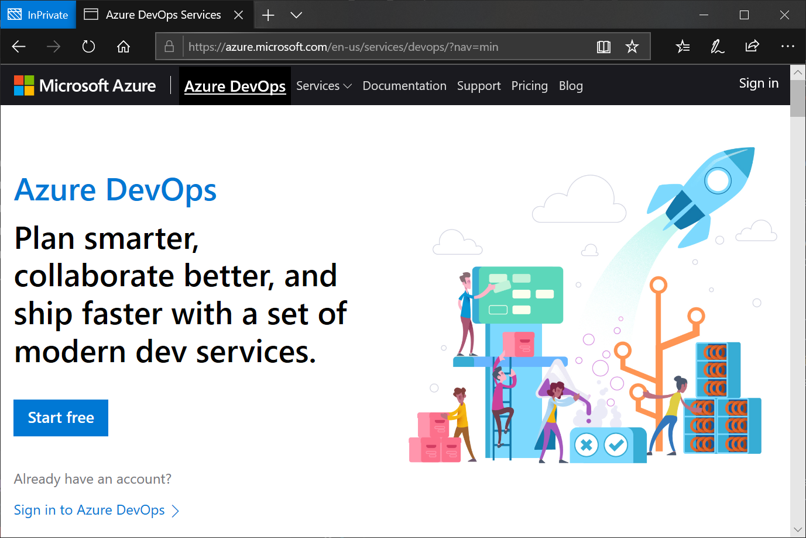
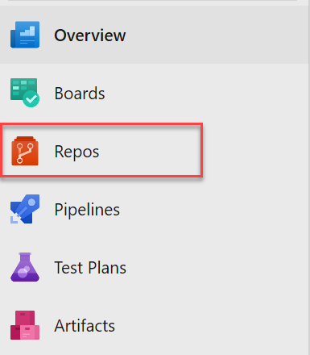

# Introduction to CI/CD with Azure DevOps

## Overview

### Objectives

In this hands-on lab, you will learn how to:

- Quickly set up two identical Azure environments using a (predefined) template
- Build a web application package in a Continuous Integration (CI) Build Pipeline
- Deploy the web application package to Azure environments with a Continuous Delivery (CD) Release Pipeline
- Track functional changes throughout the CI/CD Pipelines
- Use automated tests within the pipeline

### Prerequisites

Typically these should be preconfigured for you (if in doubt, ask your instructor):
* An active Azure subscription or at least two resource groups (one for "dev", one for "prod") to which you have contributor permissions.
* Contributor access to an Azure DevOps team project.
* Endpoint Creator access for the Azure DevOps team project (your account needs to be in the "Endpoint Creators" group in the team project).

---

Estimated time to complete this lab: **120-180** minutes.

## Exercise 1: Log on to the Azure Cloud Shell

1. Open the [Azure Portal](https://portal.azure.com), log on with your lab account, if necessary. You can see the currently logged on account in the top right of the portal:

    

    If this is not the lab user that was provided to you, please start a new "In Private" or "Incognito" window and start the Azure portal again.

1. Start the Azure Cloud Shell (Bash) by clicking the console icon in the top bar of the portal:

   

    In case you have not worked with the Azure Cloud Shell before, you will be asked a few questions. Click **Bash (Linux)** and **Create Storage**, accept all defaults. Your console should then look like this:

   

---
**Tip:** *You can open another instance of cloud shell by starting a new browser tab or window and navigating to [https://shell.azure.com](https://shell.azure.com). This way you have more space and you can easily switch between the portal and the cloud shell.*

---

## Exercise 2: Create the Azure environments

1. In the cloud shell, type:
    ```sh
    git clone https://github.com/cadullms/simplegreet 
    ```
    With this we are ready to create our two environments with only one command (per environment).
1. Briefly explore what you just downloaded (cloned) from github: In the toolbar of the shell click **Open editor**:

    

    This opens a text editor above the shell.
1. In the editor, navigate to the file `simplegreet/template/webapp-sql.json` and have a brief look at its json structure. This is the Azure Resource Manager (ARM) template that we are going to use to set up our environments. If you are interested in how templates like this work: This will be the topic of an upcoming lab. For now, we will simply be using the template.
1. In the cloud shell, execute this command:
    ```sh
    az group deployment create -g <resource group name> --template-file simplegreet/template/webapp-sql.json --parameters '{"name":{"value":"<a unique name>"}}' 
    ```
    Where...
    * `<resource group name>` is the name of your **Dev** resource group.
    * `<a unique name>` is a name in lower case letters that you can freely choose, but that must still be available as `<a unique name>.azurewebsites.net`. The name should have 'dev' in its name as well. You might want to check the availability of the name by typing `nslookup <a unique name>.azurewebsites.net` in any shell and check whether that returns an IP already.
1. If the operation succeeds, check your new website in a browser at `https://<a unique name>.azurewebsites.net` - it does not contain our application yet but should show a generic app service page.
1. Repeat the two preceding steps with the **Prod** resource group and another unique name.

## Exercise 3: Set up Azure DevOps

1. In an additional Incognito/InPrivate browser tab, navigate to `https://dev.azure.com/`. You should be seeing something like:

    

1. Click **Start free**. If needed, log in with the credentials that were provided to you. Make sure that you are not logged in with another account than your lab user.

1. When asked, click **Continue**. This will create a so called `organization` with the name of your account (e.g. `labuser`). The organization is the root object for your work in Azure DevOps and contains projects.

1. You will arrive at a screen that asks you to ***Create a project to get started**. At that screen, enter "simplegreet" as the project name, leave everything else as default, then click **Create project**. Now we have everything ready to start a full development project for free, including backlogs, kanban boards, code repositories, building and deploying software and much more. What is not included in the *free* version of Azure DevOps is the compute power that is needed for performing the resource-intensive tasks of actually building and deploying software. Thus, to enable our CI/CD pipeline, we need to add one piece: A build agent. We will do that in the next exercise.

## Exercise 4: Create a build and release agent

The agent is a piece of cross-platform software that can run anywhere in the cloud or on premises and connects to Azure DevOps to wait for jobs to be executed, like building a piece of software, running tests, deploying software, and so on. You can learn more about the different scenarios of using agents [here](https://docs.microsoft.com/en-us/azure/devops/pipelines/agents/agents?view=vsts). We will use the quickest option of running a private agent using our [build agent container image](https://hub.docker.com/r/microsoft/vsts-agent/) from Docker Hub.

For the creation of an agent we always need to authenticate against Azure DevOps. In the container we will not be able to do that interactively, thus we will be using another authentication option for Azure DevOps, a so-called Personal Access Token (PAT). Getting the PAT will be our first task.

Then, our containerized build agent will run in Azure Container Instances (ACI), a service in which we can run single containers without any up-front setup with just one command.

1. Create a PAT for your Azure DevOps organization as described [here](https://docs.microsoft.com/en-us/azure/devops/organizations/accounts/use-personal-access-tokens-to-authenticate?view=vsts). Use the scope **Agent Pools (read, manage)** for the PAT and copy it.

1. In the cloud shell, execute:
    ```sh
    az container create -g <resource group> --image microsoft/vsts-agent -e VSTS_ACCOUNT=<azure devops organization name> VSTS_TOKEN=<pat> --no-wait 
    ```
    Where `<resource group>` is one of the resource groups you were provided, `<azure devops organization name>` is the name of the Azure DevOps organization (usually starting with `labuser`) and `<pat>` is the PAT you just created.

    The operation will take a while. We will check the results later. For now, let's go on with our pipeline.

## Exercise 5: Import Code and Create the Azure DevOps Build Pipeline

To build something in a Build Pipeline, first we need some code. Luckily, we do not need to really develop something now, we will just import the code. Then we will create the pipeline with a so called yaml-Definition. This contains all information about how our code will be compiled and packaged in Azure DevOps.

1. In your browser, navigate to your Azure DevOps project. In case you are lost, you can just start brwose `https://dev.azure.com` and make sure you are logged in as your lab user.

1. In your project, click **Repos**:

    

    You will see an empty git repository.

1. In the repository view, under **or import a repository**, click **Import** and enter the url `https://github.com/cadullms/simplegreet` and click **Import**:

    

    This will start the import process, which should not take long. The imported repository is the same we cloned to get our infrastructure - it contains the code for our application as well.

1. Once the import has finished, your browser should show a code explorer view of the imported code. You can look at the `README.md` file to get some info about the application.

1. Briefly explore the application code in the `myapp` folder. The most interesting part for us is the file `pom.xml`, which contains all information we need to build the application with [Maven](https://maven.apache.org/). This is what an application developer would use to build the app on a dev machine, but we can (should) use the same file for building in the cloud. For that we need something more, which will be shown in the next step.
