# Introduction to Automated Testing with Azure DevOps

## Overview

In this lab you are going to explore Azure DevOps with a focus on automated testing. You will learn about the differences of the build and release pipelines and get to know where which type of automated test is appropriate.

The baseline of this lab is a pre-built solution called [Parts Unlimited](https://github.com/Microsoft/PartsUnlimited). Based on this solution, an Azure DevOps Environment has been prepared for you via the [Azure DevOps Demo Generator](https://azuredevopsdemogenerator.azurewebsites.net/).

The Azure DevOps environment contains all the source code, pre-configured build and pre-configured release pipelines.

## Prerequisites

* A modern browser. For example, Edge, Chrome/Chromium or Firefox.
* Visual Studio Code

Depending on your lab environment, a pre-configured Virtual Machine might be available for you.

## Preparation - Your Work Environment

Follow the guidelines from the instructor to either use a provided VM or your local environment with the outlined prerequisites.

1. Open Visual Studio Code.
    

1. Install the *C#* extension.
    

1. Install the *.NET Core Test Explorer* extension.
    

1. Clone the repository from the Azure DevOps project. Therefore go to [Azure DevOps Start Page](https://azure.microsoft.com/en-us/services/devops/) and sign in with your provided username and password combination.
1. You should see your assigned pre-configured project, e.g. 'Lab1User030'.
    
1. Go to *Repos* and select *Clone*. Copy the Git Repo URL.
    
1. In Visual Studio Code, open the Command Palette (View -> Command Palette or `CTRL-Shift-P`) and type `git clone`. Paste the copied git repo URL from Azure DevOps.
    

1. Select a destination location on the local hard drive (or just use the default in the user's home dir).
    

1. Now, the authentication dialog for the Git Repo appears. Continue by entering your provided credentials (same as for Azure Portal and Azure DevOps).
    

1. You will be prompted by VS Code, if you want to immediately open the cloned repo, select yes. You should now see the full repo.
    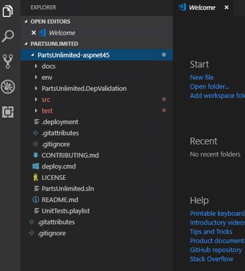

1. In order to do successful commits later, you need to make sure that the git environment is configured correctly. If you are working on a fresh lab VM, open a command prompt (`Windows Key + R`, type `cmd` and press `Enter`). Issue the following two commands, replacing with your actual identities:

    ```sh
    git config --global user.name "Lab1User030"
    git config --global user.email "Lab1User030@contoso.com"
    ```

    

That is it for the moment. You have now a functional local environment.

## Preparation - Azure DevOps Pipelines

1. Go to the [Azure DevOps Start Page](https://azure.microsoft.com/en-us/services/devops/) and sign in with your provided username and password combination.
1. You should see your assigned pre-configured project, e.g. 'Lab1User030'.
    
1. Select 'Releases' in the 'Pipelines' tab.

    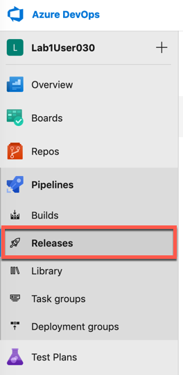
1. Now 'Edit' the existing release plan.
    
1. There are three small issues we need to fix highlighted with a red explanation mark. Start from left to right with the 'Dev' environment.
    
1. But first, we need to change a pipeline-wide variable that defines the resource group target for the deployment. Open the variables tab.
    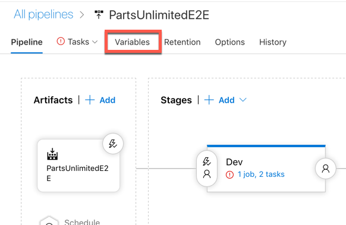

1. And change `ResourceGroupName` to e.g. `CONTOSO_RG_LAB_030` (whatever resource group was assigned to you).
1. Now select the the `Dev` stage in the `Tasks` panel.
    

1. Modify the `Azure Subscription` to use the first available `Service Connection`. Do **not** select the subscription when you were assigned a dedicated resource group.
    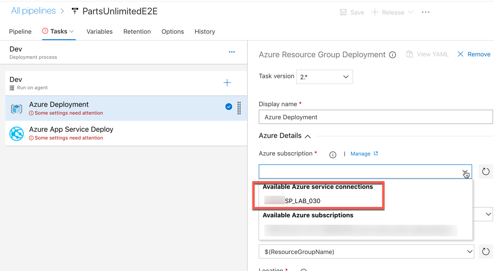

1. Update the location to, e.g. `West Europe` (stick to this for all environments).
    

1. Now switch to the second step `Azure App Service Deploy`.
    

1. Also fix the `Azure Subscription` setting as before and enter `Dev` in the slot setting.
    

1. Switch to the `QA` task now. Apply exactly the same config as before, except for the slot setting. Here you will enter `Staging`.
    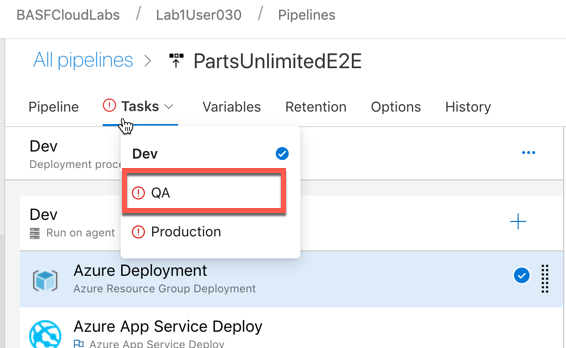
    

1. Finally, head over to the `Production` task. Repeat the config updates from before. Note, this time you don't have to enter a slot setting as the default slot is the production slot. Save all your changes. If the Save button is still grayed out, you missed an error and need to fix it. In the popup that appears you can enter any descriptive message.
    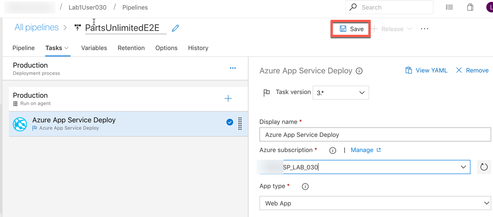
    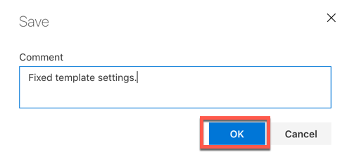

## Exercise 1: Full Deployment Run-Through

After finishing the boring preparation work, let's do our first end-to-end deployment!

1. Switch to the `Build` pipeline. You will notice that no build has been running so far. The build pipeline is configured to run whenever a git check-in happens. As we never committed code so far... no builds!
    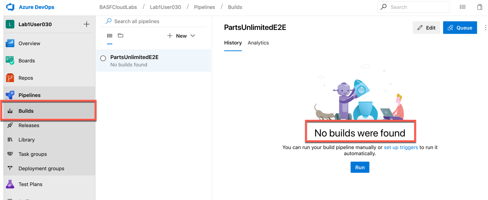

1. Before actually doing code changes, let us run a build by manually scheduling one. Click on `Queue`.
    

1. Keep all the defaults and confirm.
    

1. You can follow the progress by selecting the scheduled build. After a short while the logs from the agent are streamed to your browser session:
    

1. The configured automation does not stop here! Actually, there is some continuous delivery magic configured here. It will trigger the *Release* pipeline for every successful build that happens in the *Build* pipeline. In the *Release* pipeline, it will deploy the latest build into the *Dev*, *QA* and *Production* environment.
    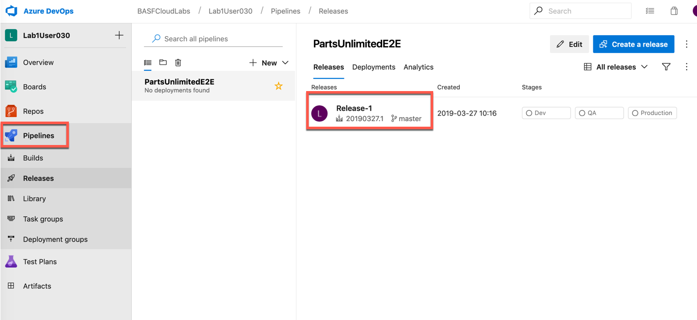

1. Click on the scheduled release and observe the pipeline update. You should see a deployment activity being executed.
    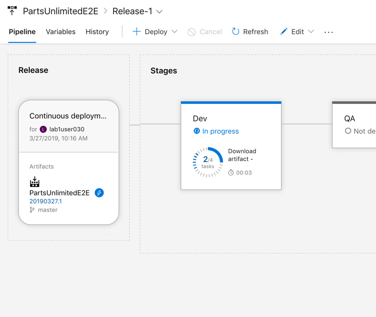

1. Once everything ran successful you should see the following picture.
    

1. Now head over to the Azure Portal. You will see the Azure resources in your resource group.
    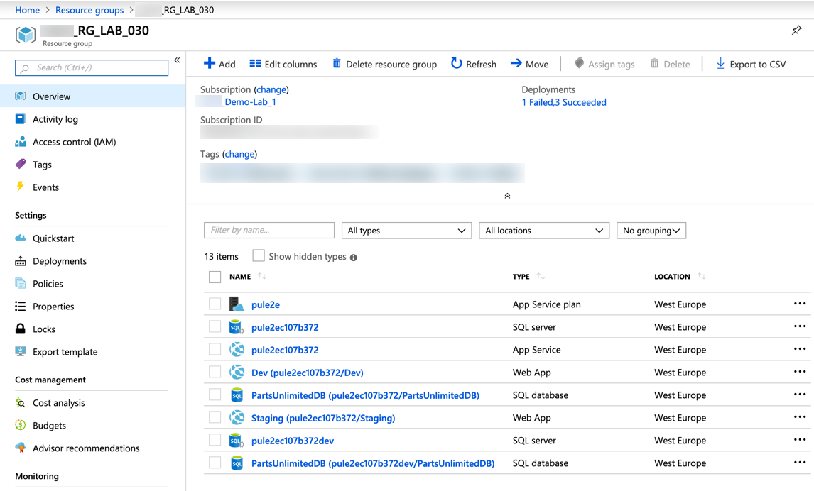

1. Select the `Dev` slot of the deployed web app.
    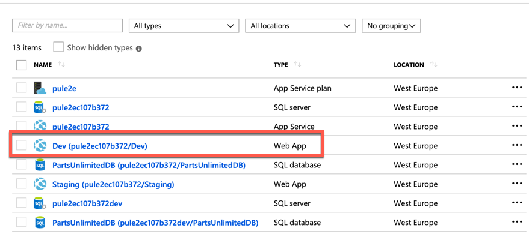

1. In the details, look for the assigned URL and navigate to it. Please note the little `-dev` suffix attached to the hostname. This is the differentiation between the *Slots* that you have configured previously.
    

1. You should now see our great *Parts Unlimited* Web Shop experience.
    

## Exercise 2: Unit Tests

Unit tests are part of every good build pipeline. In this exercise we will forcefully create a failing build via a failing unit test and correct it again. This will give you some idea about the guardrails that unit test bring to an automation pipeline.

1. Switch to Visual Studio Code. As preparation you should already have checked out the source code of the Parts Unlimited solution. If not, please do so now.

1. Open the file `ProductSearchTests.cs` and modify a test case as depicted in the screenshot to trigger a failing unit test:

    

1. Commit your changes.

    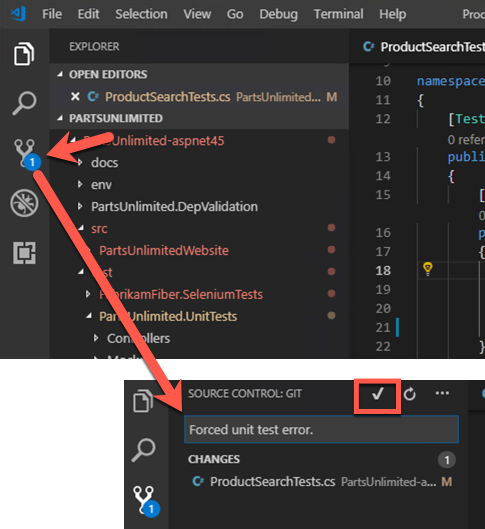

1. Push the changes to your central git repo in Azure DevOps. To do so, press the *sync button* in the status bar.

    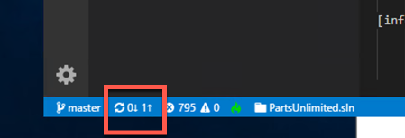

1. Go to your browser and open the *Build* pipeline. You should now see *Continuous Integration* in action. That is, the push to the central repo that you just committed, triggered an automatic build.

    

1. As expected, the build won't succeed this time as the modified unit test fails. Review the status in the build summary.
    

1. Also observe, that no deployment has been performed - which is actually the whole reason behind our automated test and failure detection.
    

1. Now put everything back to normal by modifying the test code again (back to the good state), commit and push. Here you'll observe the CD pipeline kicking in again.

    

## Exercise 3: Release Pipeline and UI Tests

### Task 1: Run a UI Test Locally

First, let's make sure that you can actually work with your environment.

1. Open a new Visual Studio Code instance/window.

1. Git clone `https://github.com/olohmann/selenium-dotnet-core-hello-world.git`.

1. Open the repository when prompted.

1. Run the *build* task.
    

1. Open the Test Explorer tab. Navigate down to the actual test and press the play button.
    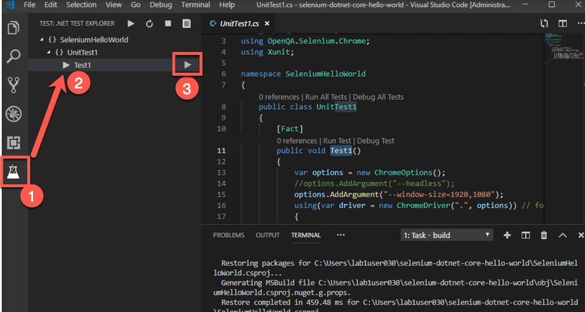

1. A Chrome instance should be opened and text should be entered automatically as stated in the UI test.

If everything worked so far, you are good to go to the next task.

### Task 2: Fix Parts Unlimited JavaScript Code

If not done yet, take a few moments to navigate around your personal *Parts Unlimited* website which you deployed before.

1. Before we can run the first UI test, we unfortunately need to fix an issue with the JavaScript setup in the actual project. Open your command prompt (cmd) and navigate to your checked out folder:

    ```text
    cd %USERPROFILE%\PartsUnlimited\PartsUnlimited-aspnet45\src\PartsUnlimitedWebsite\Views\ShoppingCart
    ```

1. If the previous command has failed you, you put the source code to another location. Please `cd` into your directory accordingly. Then issue the following commands (you can copy and paste):

    ```text
    curl -o Index.cshtml https://gist.githubusercontent.com/olohmann/979df6f733d02ebb322d54b9c6ebdbe7/raw/36a48e3c9d3246392f377c69a7762eb6c53ac330/Index.cshtml
    git add Index.cshtml
    git commit -m "Fixed JavaScript issue"
    git push
    ```

1. Now, the solution is ready for our UI tests.

### Task 3: Write a UI Smoke Test and Integration into AzureDevOps